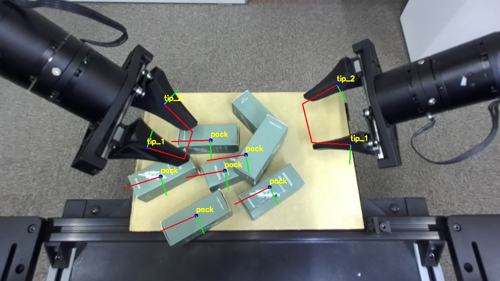

## Visual Support by YOLO Segmentation

The objective is to provide visual feedback to the operator.

YOLO is used to segment the robot's tip and generate corresponding mask images.

All trained classes are segmented and grouped according to their categories.

The pose of each object is estimated based on the inertia of its mask image.

  
  
<em>Figure 1: Visual Assistane by YOLO's Segmentation</em>

