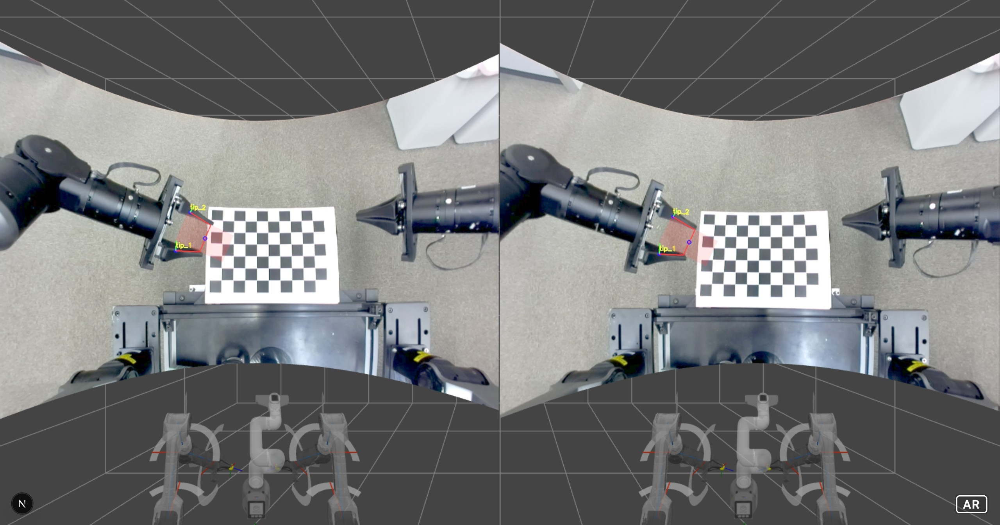
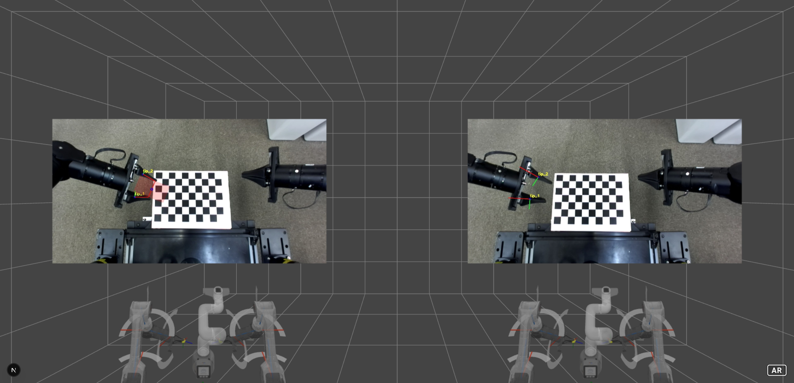

# Camera Undistortion for ZED Mini (UVC Mode)

ZED Mini can be used as a **UVC (USB Video Class)** camera, allowing direct access through **OpenCV**.  
However, OpenCV only provides **raw frames**, which means the images include **lens distortion**.

<div align="center">
  
  <p><em>Figure 1: Scene with origin UVC frame.</em></p>
</div>

<div align="center">
  
  <p><em>Figure 2: Scene with undistorted frame.</em></p>
</div>

To correct this distortion, there are two main approaches.

---

## 1. Using `a-curvedimage` in A-Frame (VR Rendering)

This method doesn’t require explicit image undistortion.  
Instead, it maps the raw image onto a **curved surface** in VR, creating a wide-FOV undistorted appearance.

```html
<a-curvedimage
  id="left-curved"
  height="7.0"
  radius="5.7"
  theta-length="120"
  position="0.2 1.6 -1.0"
  rotation="0 -115 0"
  scale="-1 1 1"
  stereo-curvedvideo="eye: left; videoId: leftVideo">
</a-curvedimage>

<a-curvedimage
  id="right-curved"
  height="7.0"
  radius="5.7"
  theta-length="120"
  position="0.2 1.6 -1.0"
  rotation="0 -120.3 0"
  scale="-1 1 1"
  stereo-curvedvideo="eye: right; videoId: rightVideo">
</a-curvedimage>
```

✅ Pros

- No need for real-time undistortion computation

- Natural, wide-angle VR rendering

⚠️ Cons

- Only visually correct in VR — not for image analysis

- Pixel coordinates are non-linear and not geometrically accurate

## 2. Using OpenCV Undistortion

If you need to perform image processing or 3D position estimation, you must use the undistorted image.

### Steps

### 1. Calibrate the camera
Capture multiple checkerboard images and run `cv2.calibrateCamera()` to obtain:

- Intrinsic matrix $K$
- Distortion coefficients $dist$

### 2. Apply undistortion
Details check folder `calibration`


