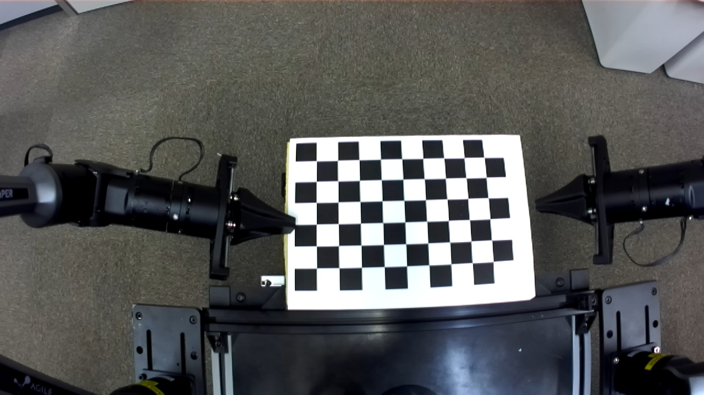
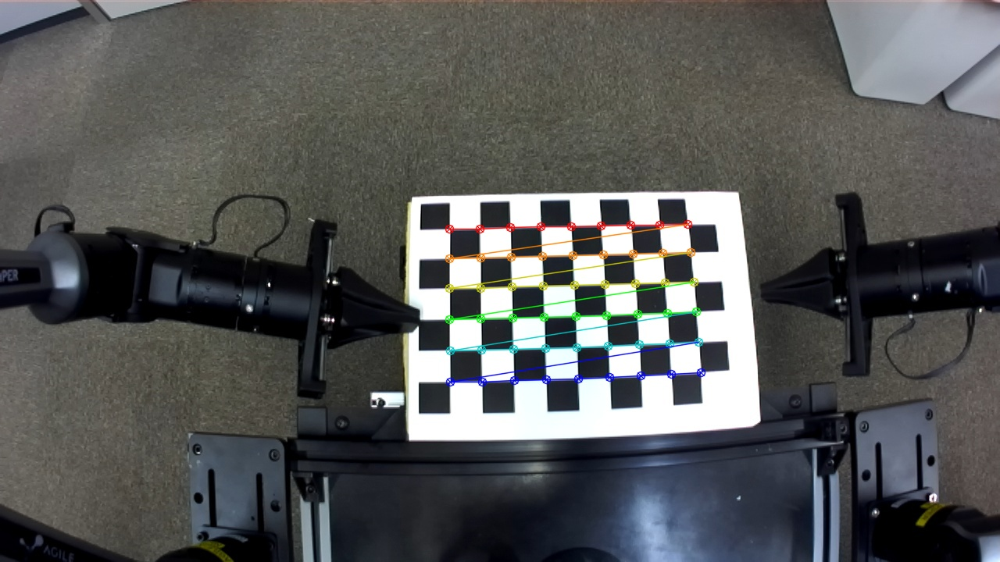
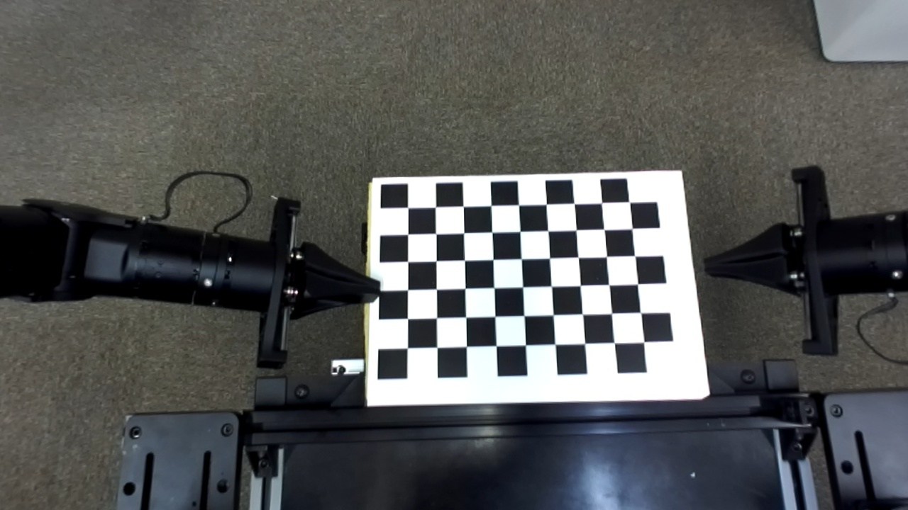

# 📸 Camera Distortion Correction Workflow

Camera lenses often introduce **geometric distortions** that reduce image accuracy — an important issue in applications such as **3D reconstruction**, **stereo vision**, and **robotics**. 
This document summarizes the workflow for **camera distortion calibration and correction**.

---

## 1. Understanding Camera Distortion
Real-world camera lenses deviate from the ideal pinhole camera model due to optical imperfections. These distortions are typically categorized as:

### Radial Distortion

Radial distortion is caused by the **curvature of the lens elements**, resulting in either:

- **Barrel distortion** → image bulges outward (lines curve away from the center)
- **Pincushion distortion** → image curves inward (lines bend toward the center)

The correction model can be expressed as:

$$
x_{radial} = x (1 + k_1 r^2 + k_2 r^4 + k_3 r^6)
$$

$$
y_{radial} = y (1 + k_1 r^2 + k_2 r^4 + k_3 r^6)
$$

### Tangential Distortion

Tangential distortion occurs when the **lens and image sensor** are not perfectly parallel,  
causing image points to shift diagonally.

The correction model is:

$$
x_{tan} = x + 2p_1xy + p_2(r^2 + 2x^2)
$$

$$
y_{tan} = y + p_1(r^2 + 2y^2) + 2p_2xy
$$

where  

$$r^2 = x^2 + y^2$$  

and the parameters are:  
- $$k_1, k_2, k_3$$: **radial distortion coefficients**  
- $$p_1, p_2$$: **tangential distortion coefficients**

The totla Distortion is represented by:

$$
x_{corr} = x_{radial} + x_{tan}
$$
$$
y_{corr} = y_{radial} + y_{tan}
$$

---

## 2. ZED Mini Undistortion Model

The **ZED Mini** camera follows the **pinhole camera model**,  
which relates 3D world coordinates to 2D image coordinates via the **intrinsic matrix** $$K$$:
  
$$
K =
\begin{bmatrix}
f_x & 0   & c_x \\
0   & f_y & c_y \\
0   & 0   & 1
\end{bmatrix}
$$

Here:  
- $$f_x, f_y$$ are the **focal lengths** in pixels  
- $$c_x, c_y$$ are the **principal point offsets**

The **distortion coefficients** are typically represented as:

$$
dist = [k_1, k_2, k_3, p_1, p_2]
$$

Once the intrinsic matrix `K` and distortion coefficients `dist` are known,  
the image can be undistorted using OpenCV as follows:

```
h, w = img.shape[:2]
newcameramtx, roi = cv2.getOptimalNewCameraMatrix(K, dist, (w, h), 0, (w, h))
undistorted = cv2.undistort(img, K, dist, None, newcameramtx)
```

---

## 3. ZED Mini Undistortion Example
The original **ZED Mini** intrinsic and distortion parameters are:

$$
K =
\begin{bmatrix}
734.8106079101562 & 0   & 650.7424926757812 \\
0   & 734.8106079101562 & 355.0272216796875 \\
0   & 0   & 1
\end{bmatrix}
$$

$$
dist = [0, 0, 0, 0, 0]
$$

However, even when using these default parameters, the captured images still exhibit noticeable **distortion** near the edges (Figure 1).

After performing **recalibration using chessboard images**, the refined undistortion parameters are obtained as follows:

$$
K =
\begin{bmatrix}
788.41415049 & 0   & 655.01692926 \\
0   & 787.3765135 & 357.82862631 \\
0   & 0   & 1
\end{bmatrix}
$$

$$
dist = [-0.3506601, 0.18558038, -0.00065609, 0.00100313, -0.05786136]
$$

<div align="center">
  
  <p><em>Figure 1: Original image captured by the ZED Mini.</em></p>
</div>

<div align="center">
  
  <p><em>Figure 2: Detected chessboard corners used for calibration.</em></p>
</div>

<div align="center">
  
  <p><em>Figure 3: Undistorted image after applying refined parameters.</em></p>
</div>


  
  
